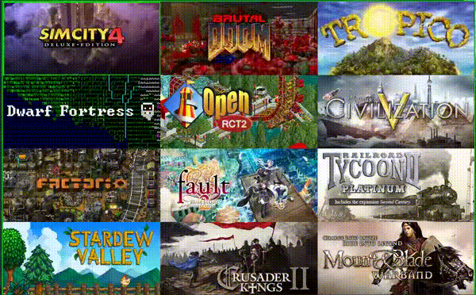

# Banner Launcher

Banner Launcher is a (WIP) games launcher written with GTK+3 which uses Steam
banner/header images. They are 460x215 sized images which are used in the
grid view of the Steam Client. Banner Launcher can be used to launch any
application but can automatically use Steam games.

## Old QT5 Demo

## TODO

### UI

- Steam Import Window
- Add/Edit Entry Window
- Settings Window
- Icons/hints for problems in games (missing image?)
- Input Works on main window as I desire:
  - Typing always edits the filter box and filters games
  - Arrow keys go from filter/search box down into Entries
  - Enter Runs Game
  - Scrolling scrolls the entries
  - Escape Closes Launcher
- First Run Window:
  - Where is steam (if not found)?
  - Do you want the app to add new steam games automatically?

### Functionality

- Favorites?

### Done

- Context Menus for Entries
- Config file
- Sort games by count then lex
- Launch Game Functionality
    - cd
    - Steam launch by id
- Update Steam games every run
